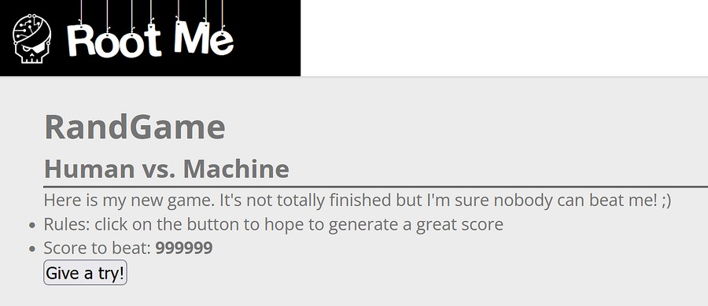
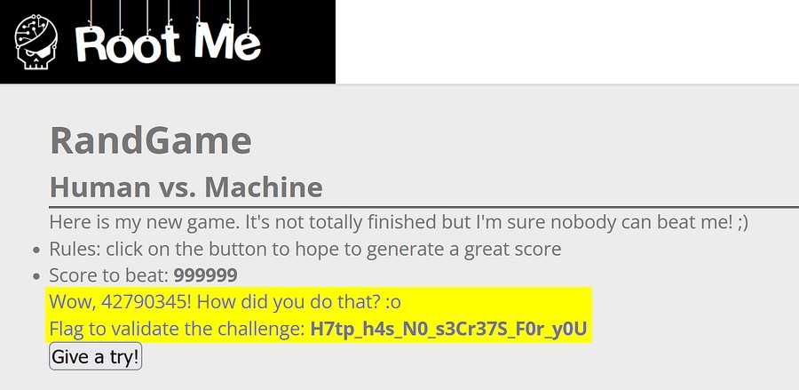
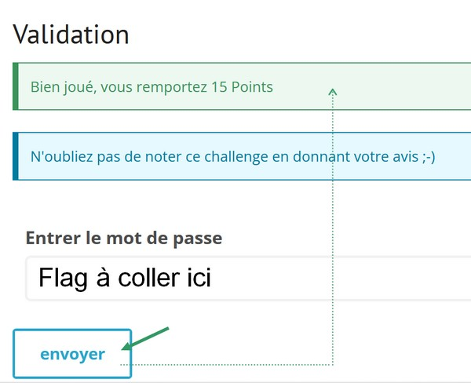

# Root Me Challenge
https://www.root-me.org/fr/Challenges/Web-Serveur/HTTP-POST

<hr>

## Objectif du challenge : 
> ## → Trouver une façon de battre le meilleur score

<br>

### <a name="Synopsis">Synopsis</a> :  

Si l'on fait moins que le meilleur score **`999999`** on perd. Le but étant de battre ce score...
<br>Pour lancer le jeu on clique sur le bouton **`Give a try !`**.
<br>



<br>

## [ SOMMAIRE ]

- [Objectif du challenge](#Synopsis).
  - _Que se passe t'il en cliquant sur le bouton ?._
  - _Protocol HTTP et méthode POST_
- [Explications du code lié au bouton](#méthodologie).
- [Fonctionnement du code](#fonctionnement-du-code).
- [Conclusion et **Hack** du code](#conclusion).

<hr>
<br>

**Que se passe t'il en cliquant sur le bouton ?** 
... That is a question.
#### Protocol HTTP
> En cliquant sur le bouton cela va envoyer une requête (demande) d'un certain type au serveur web via le protocol **HTTP** (_hyperText Transfert Protocol_) qui traitera la demande et renverra le résulat dans un navigateur(client). C'est un protocole de communication  dit : client / serveur. <br>
>
>- _Il fonctionne sur le port 80 et utilise le protocole TCP comme couche de transport._ <br>
>- _HTTP est un protocole de la couche application dans le modèle OSI (couche 5.6.7)._

  Il existe la version HTTPS qui est la variante sécurissée avec du chiffrement. Cette version utilise le port 443.

#### Méthode POST
> Le type ou la méthode ici est **POST**. La méthode POST est utilisée pour transmettre des données au serveur pour crééer ou mettre à jour une ressource (le plus souvent un formulaire HTML(_HyperText Markup Language_)).
>   
> - **Paramètres** : Les paramètres sont envoyés dans le corps de de la requête HTTP et non dans l'URL. Cela permet d'envoyer des quantités de données plus importates.
>
>- **Limite de longueur** : Il n'y a pas de limite stricte de longueur pour les données envoyées, ou seulement si c'est déterminé par la configuration du serveur.
>
> - **Visibilié** : Les paramètres ne sont pas visibles dans l'URL. Cela la rend donc plus sécurisées... pour l'envoi de données sensibles.
>
> - **Cache** : Elle ne sont pas mises en cache par défaut.
> 
> - **Bookmark**s : Les requêtes POST ne peuvent pas être mises en favoris, car elle ne sont pas représentées par un URL.

<br> 

>>> Il existe aussi la méthode **GET** qui via une requête qui peut-être visible dans l'URL (Uniform Ressource Locator) du navigateur._ 
>>    - _Permet par exemple d'accèder à d'autres pages d'un site._
>>    - _Permet de récupérer des données d'un serveur web._
>>
>>  - _**Paramètres**_ : Les paramètres sont envoyés dans l'URL, après le point d'interrogation. <br>
      Par exemple : http://example.com/page?param1=value1&param2=value2.-
>>
>>  - _**Limite de longueur** : Les URL ont une limite de longueur (environ 2048 caractères dans la plupart des         navigateurs), donc la quantité de données que vous pouvez envoyer est limitée._
>>
>>  - _**Visibilité** : Les paramètres de la requête sont visibles dans l'URL, ce qui les rend moins sécurisés pour l'envoi de données sensibles._
>>
>>  - _**Cache** : Les requêtes GET peuvent être mises en cache par les navigateurs, les proxies et les serveurs._
>>
>>  - _**Bookmark** : Les requêtes GET peuvent être mises en favoris ou partagées via l'URL, ce qui est pratique pour les recherches et les pages statiques._

  ```
  Faire un teste avec l'inspecteur dans le navigateur sur votre page, en changeant la méthode "POST" EN "GET"; 
  Observer ensuite votre URL.
  ```

- https://www.ionos.fr/digitalguide/sites-internet/developpement-web/get-vs-post/#c251633
 

> L'URL est un mécanisme utilisé par les navigateurs pour accéder à toute ressource publiée sur le net. l’URL équivaut à l'adresse postale du facteur. Cette adresse est ainsi utilisée pour pouvoir accéder à une page d'un site internet telle que la page d'accueil, la page de contacts... 

    Elle peut-être composée :
    -------------------------
    - Du protocol
    - D'un nom de domaine et sous-domaine
    - D'un chemin
    - et de paramètre ou requête (après le ?)  

- https://www.numacom.fr/blog/qu-est-ce-qu-une-url-definition-et-fonctionnement

<br>

```
HTTP est avec HTML et les URL une des trois inventions fondamentales de Tim Berners-Lee pour créer le World Wide Web.
```

<br>

## Une fois la page du jeu affichée :

Le but est de trouver comment afficher le code, pour le hacker, de façon à gagner en faisant plus que 999999.

### Méthodologie: 

- Ouvrir l'inspecteur (F12).
  
    - **Trouver la ligne de code qui permet l'envoie de la requête.** 
    - 
        Indice ...
        - _Celle-ci est envoyée avec la méthode POST via un formulaire._
  
        ### Explication :

        ```html
        <form action="" method="post" onsubmit="document.getElementsByName('score')[0].value = Math.floor(Math.random() * 1000001)">
            <input type="hidden" name="score" value="-1" />
            <input type="submit" name="generate" value="Give a try!">
        </form>
        ```        

       **↑** Ce morceau de code HTML avec du Javascript ci-dessus, comprend un formulaire contenant un champ caché et un bouton de soumission. 
       <br>

       ### De façon plus précise ...

        ####  1. Balise `<form>`

        ```html
        <form action="" method="post" onsubmit="document.getElementsByName('score')[0].value = Math.floor(Math.random() * 1000001)">
        <form>
        ```  
                
        La balise `<form>` Définit un formulaire HTML.

        - **action=""** : Spécifie l'URL vers laquelle les données du formulaire doivent être envoyées. Une valeur vide signifie que le formulaire sera soumis à la même URL que la page actuelle.
  
        - **method="post"** : Indique que les données du formulaire seront envoyées via une requête HTTP en POST.
  
        - **onsubmit="..."** : Attribut JavaScript, qui spécifie une fonction ou un script à exécuter lorsque le formulaire est soumis. Ici, le script JavaScript change la valeur du champ caché `score` avant la soumission du formulaire.
  
        Fonction JS :
        - **Math. floor(x)** renvoie le `plus grand entier` qui est `inférieur ou égal` à un nombre x.
  
        - **Math.random()** renvoie un nombre flottant pseudo-aléatoire, généré entre 0 (inclus) et 1 (**`exclu`**)”. Le chiffre généré se situe entre 0 et 0.99 dans ce cas.

        <hr>

        ####  2. Champ caché  `<input>`
        ```html
        <input type="hidden" name="score" value="-1" />
        ``` 
        La balise `<input>` Définit un champ de saisie de données.

        - **type="hidden"** : Indique que se champ est caché et ne sera pas visible pour l'utilisateur.
        - **name="score"** : Nom du champ utilisé pour identifier les données lors de la soumission.
        - **value="-1"** : Valeur initiale du champ, ici définie à "-1". 

        <hr>

        ####  3. Bouton de soumission `<input>`

        ```html
        <input type="submit" name="generate" value="Give a try!">
        ```
        La balise `<input>` Définit un champ de saisie de données.

        - **type="submit** : Spécifie que ce champ est un bouton de soumission qui envoie un formulaire.
        - **name="generate"** : Nom du champ, bien qu'il ne soit généralement pas utilisé pour les boutons de soumission. 
        - **value="Give a try!** : Texte affiché sur le bouton.
        
        <hr>
        <br>

### Fonctionnement du code

####  1. Avant la soumission, l'attribut **`onsubmit`** exécute le script JavaScript suivant :

```javascript
document.getElementsByName('score')[0].value = Math.floor(Math.random() * 1000001)
```

- **document.getElementsByName('score')[0]** :  Sélectionne le premier élément du document avec le nom **`score`**.
- **.value** : Accède à la valeur de cet élément.
- **Math.floor(Math.random() * 1000001)** : Génère un nombre entier aléatoire entre 0 et 1.000.000 et assigne ce nombre aléatoire à la valeur du champ caché **`score`**.

#### 2. Le formulaire sera soumis avec la nouvelle valeur aléatoire du champ `score`.

### Conclusion

En cliquant sur le bouton **`Give a try !`** cela va générer un nombre aléatoire entre 0 et 1 000 000 et l'assigner au champ caché `score` avant de soumettre le formulaire. 
La valeur du champ caché `input` est à -1.

La valeur aléatoire maximum étant 1 000 000 - la valeur du champ caché qui est `-1`. La valeur maximum sera 999 999.

####  Pour hacker le code. 
- Pour gagner et hacker le jeu il faut modifier la valeur du coéfficient multiplicateur en rajoutant un zéro par exemple.

```html
<form action="" method="post" onsubmit="document.getElementsByName('score')[0].value = Math.floor(Math.random() * 100110001)">
<form>
```
- Ensuite soumettez de nouveau le formulaire.



- Retourner sur la page du challenge et coller le Flag dans la zone de saisie pour réussir le challenge.




